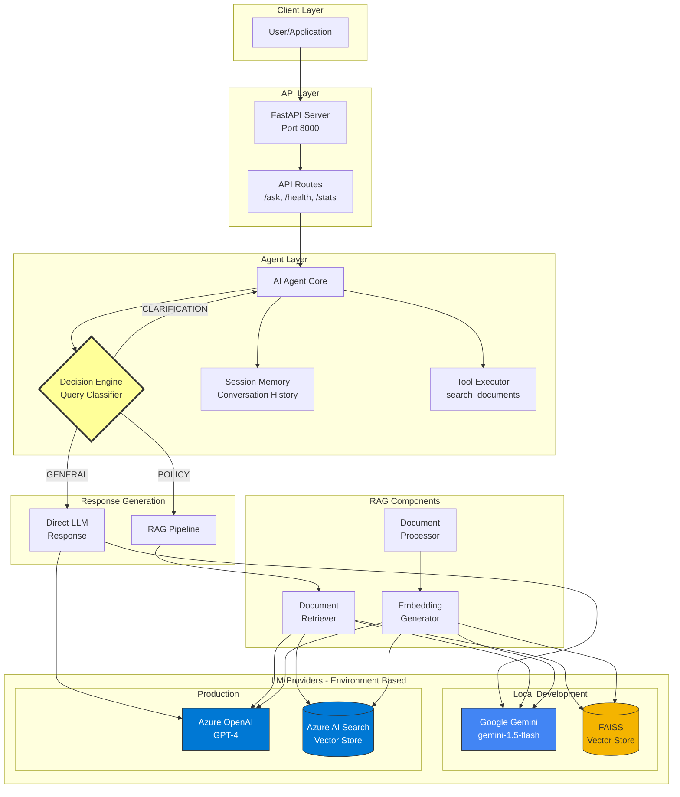

# PolicyBot AI Agent

**Enterprise-Grade Intelligent Document Question Answering System**

PolicyBot is an AI agent that intelligently answers questions about company policies using Retrieval-Augmented Generation (RAG). Features automatic decision-making between direct LLM responses and document retrieval, dual environment support (local development + Azure production), and comprehensive tooling.

[](https://www.python.org/downloads/)
[](https://fastapi.tiangolo.com)
[](https://ai.google.dev/)
[](https://azure.microsoft.com/en-us/products/ai-services/openai-service)

---

## 🎯 Features

✨ **Intelligent Decision Engine** - Automatically classifies queries and routes to optimal response strategy  
🔄 **Dual Environment** - Local (Gemini or Azure OpenAI) + Production (Azure OpenAI only)  
📚 **RAG Pipeline** - Semantic search with FAISS (local) or Azure AI Search (production)  
💬 **Session Memory** - Maintains conversation context across interactions  
🛠️ **Tool Calling** - Extensible tool system (document search, calculations)  
🐳 **Docker Ready** - Multi-stage builds with security best practices  
☁️ **Azure Deployment** - Complete CI/CD with GitHub Actions  
📊 **Monitoring** - Application Insights integration  
🧪 **Comprehensive Tests** - Unit, integration, and API tests  
📖 **Production Docs** - Architecture diagrams, API reference, deployment guides  

---

## 📐 Architecture Overview



**Component Layers:**
1. **API Layer**: FastAPI with OpenAPI docs
2. **Agent Layer**: Decision engine, memory, tools
3. **LLM Layer**: Google Gemini / Azure OpenAI
4. **RAG Layer**: Document processing, embeddings, vector search
5. **Data Layer**: Company policy documents

**→ See [docs/architecture.md](docs/architecture.md) for detailed architecture**

---

## 🚀 Quick Start

### Prerequisites
- Python 3.11+
- **For local development (default)**: Google Gemini API key ([Get free key](https://makersuite.google.com/app/apikey))
- **For local development (optional)**: Azure OpenAI access (endpoint, API key, deployment names)

### 5-Minute Setup

### Linux / macOS
```bash
# 1. Clone and setup
cd policybot-ai-agent
python3 -m venv venv
source venv/bin/activate
pip install -r requirements.txt
# For testing/dev:
pip install -r requirements-dev.txt

# 2. Configure (choose your LLM provider)
cp .env.example .env
# Edit .env: For Gemini (default): GOOGLE_GEMINI_API_KEY=your_key_here
# Or for Azure OpenAI: LLM_PROVIDER=azure, AZURE_OPENAI_ENDPOINT, AZURE_OPENAI_API_KEY, etc.

# 3. Initialize vector store
python scripts/setup_vectorstore.py

# 4. Run application
python -m app.main

# 5. Test
python scripts/test_agent.py
```

### Windows
```powershell
# 1. Clone and setup
cd policybot-ai-agent
python -m venv venv
venv\Scripts\activate
pip install -r requirements.txt
# For testing/dev:
pip install -r requirements-dev.txt

# 2. Configure (choose your LLM provider)
copy .env.example .env
# Edit .env: For Gemini (default): GOOGLE_GEMINI_API_KEY=your_key_here
# Or for Azure OpenAI: LLM_PROVIDER=azure, AZURE_OPENAI_ENDPOINT, AZURE_OPENAI_API_KEY, etc.

# 3. Initialize vector store
python scripts\setup_vectorstore.py

# 4. Run application
python -m app.main

# 5. Test
python scripts\test_agent.py
```

**API Docs**: http://localhost:8000/docs

---

## � Use Cases & Scenarios

PolicyBot is designed to solve real-world enterprise challenges. Here are key scenarios demonstrating its value:

### 1. New Employee Onboarding 🎓
**Scenario**: A new hire, Sarah, needs to understand her benefits and initial setup requirements but doesn't want to overwhelm her manager.
- **User Query**: "When does my health insurance coverage start?"
- **Agent Action**: Retrieves the `benefits_guide.txt` document.
- **Response**: "According to the benefits guide, health insurance coverage begins on the first day of the month following your start date."
- **Benefit**: Reduces "HR fatigue" and empowers new employees to self-serve information directly.

### 2. HR Department Efficiency ⚡
**Scenario**: The HR team is drowning in repetitive questions during open enrollment season.
- **User Query**: "What is the difference between the standard and premium dental plan?"
- **Agent Action**: Searches `benefits_guide.txt` and synthesizes a comparison.
- **Response**: Explains the coverage limits and deductibles for both plans side-by-side.
- **Benefit**: Frees up HR professionals to focus on complex, sensitive employee relations issues rather than FAQ answering.

### 3. Compliance & Security 🔐
**Scenario**: An employee is unsure about the rules for using personal devices for work.
- **User Query**: "Can I check my work email on my personal phone?"
- **Agent Action**: Consults `it_policy.txt` and `mobile_device_policy.txt`.
- **Response**: "Yes, but you must install the MDM (Mobile Device Management) profile and enforce a 6-digit passcode as per the IT Security Policy."
- **Benefit**: Ensures standardized, policy-compliant answers are given every time, reducing security risks.

### 4. 24/7 Global Support 🌍
**Scenario**: A remote worker in a different time zone needs immediate clarification on a leave policy for an emergency.
- **User Query**: "What is the bereavement leave policy?"
- **Agent Action**: Instant retrieval from `leave_policy.txt`.
- **Response**: "You are entitled to up to 5 days of paid bereavement leave for immediate family members..."
- **Benefit**: Provides instant support regardless of time zone or HR team availability.

---

## �💻 Tech Stack

### Core Framework
| Component | Technology | Purpose |
|-----------|-----------|---------|
| **API** | FastAPI 0.109 | High-performance async web framework |
| **Validation** | Pydantic 2.5 | Data validation and settings |
| **Language** | Python 3.11 | Modern async/await support |

### AI/ML Stack

**Local Development (Configurable via `LLM_PROVIDER` env var):**
- **LLM**: Google Gemini 1.5-flash (default, `LLM_PROVIDER=gemini`) OR Azure OpenAI GPT-4 (`LLM_PROVIDER=azure`)
- **Embeddings**: Gemini embedding-001 (768-dim) OR Azure text-embedding-ada-002 (1536-dim)
- **Vector Store**: FAISS (local file storage, separate indices per provider: `faiss_index_gemini` / `faiss_index_azure`)

**Production (Azure Only - Not Configurable):**
- **LLM**: Azure OpenAI GPT-4 (always)
- **Embeddings**: text-embedding-ada-002 (1536-dim)
- **Vector Store**: Azure AI Search (managed, scalable, cloud-based)

### Infrastructure
- **Containerization**: Docker with multi-stage builds
- **Orchestration**: Docker Compose
- **Cloud**: Azure App Service + Container Registry
- **CI/CD**: GitHub Actions
- **Monitoring**: Azure Application Insights
- **Testing**: pytest with async support

---

## 📁 Project Structure

```
policybot-ai-agent/
├── app/                        # Application source
│   ├── agents/                 # AI agent core
│   │   ├── agent.py           # Decision engine ⭐
│   │   ├── memory.py          # Session management
│   │   └── tools.py           # Tool calling
│   ├── api/                    # FastAPI routes
│   │   └── routes.py
│   ├── llm/                    # LLM integrations
│   │   ├── llm_client.py      # Unified client (Gemini/Azure) ⭐
│   │   └── prompts.py         # Prompt engineering
│   ├── rag/                    # RAG pipeline
│   │   ├── document_processor.py
│   │   ├── vector_store.py    # FAISS + Azure Search ⭐
│   │   └── retriever.py
│   ├── models/                 # Pydantic schemas
│   ├── config.py              # Configuration ⭐
│   └── main.py                # FastAPI app entry point
├── data/
│   ├── documents/             # Policy documents
│   └── vector_stores/         # FAISS indices
├── deployment/
│   ├── azure/                 # Azure manual deployment scripts
│   ├── terraform/             # Infrastructure as Code (recommended)
│   ├── Dockerfile            # Multi-stage production build
│   └── docker-compose.yml
├── docs/                      # Project documentation
│   ├── architecture.md       # System design
│   ├── api.md               # API reference
│   ├── deployment.md        # Deployment guide
│   └── testing.md           # Testing guide
├── scripts/
│   ├── setup_vectorstore.py  # Initialize embeddings
│   └── test_agent.py        # Interactive testing
├── tests/                    # Test suite (unit, integration, performance)
├── .env.example             # Environment template
├── DEPLOYMENT_GUIDE.md      # Comprehensive deployment guide
├── QUICKSTART.md            # Quick start guide
├── requirements.txt         # Python dependencies
└── README.md               # This file
```

⭐ = Core components implementing assignment requirements

---

## 📖 Documentation

### User Guides
- **[Quick Start Guide](QUICKSTART.md)** - Get running in 5 minutes
- **[API Documentation](docs/api.md)** - Complete API reference
- **[Deployment Guide](docs/deployment.md)** - Local, Docker, and Azure deployment

### Technical Documentation
- **[Architecture Overview](docs/architecture.md)** - System design and data flow
- **[Design Decisions](#-design-decisions)** - Why we made key choices
- **[Limitations & Roadmap](#%EF%B8%8F-limitations--future-improvements)** - Current constraints and future plans

---

## 🎨 Design Decisions

### Why Google Gemini as Default for Local Development?
**Decision**: Use Google Gemini as the default LLM for local development (with Azure OpenAI as an alternative option)

**Rationale**:
- ✅ Fast inference (optimized for speed)
- ✅ Generous free tier (no credit card required)
- ✅ Simple setup (just API key needed)
- ✅ Good quality for development/testing
- ✅ Easy switch to Azure for production
- ✅ Developers can still use Azure OpenAI locally if preferred (set `LLM_PROVIDER=azure`)

### Why Dual Environment Support?
**Decision**: Separate local (Gemini OR Azure OpenAI + FAISS) and production (Azure OpenAI only + AI Search)

**Rationale**:
- **Local**: Fast iteration, zero cloud costs with Gemini (default), or use Azure for testing production setup
- **Production**: Enterprise SLAs, compliance, scalability, managed services with Azure OpenAI (required)
- **Flexibility**: Local environment supports both providers via `LLM_PROVIDER` config variable
- **Cost-Effective**: Developers don't need Azure subscriptions (Gemini free tier), but can opt-in if needed

### Why FAISS vs Azure AI Search?
| Feature | FAISS (Local) | Azure AI Search (Production) |
|---------|--------------|------------------------------|
| **Setup** | Instant, no dependencies | Requires Azure resource |
| **Cost** | Free | ~$250/month |
| **Performance** | Fast (local) | Fast + distributed |
| **Scalability** | Limited to local resources | Auto-scaling |
| **Features** | Vector similarity only | Hybrid search (keyword + vector) |
| **Backup** | Manual file copy | Automatic Azure backup |

**Best of both worlds**: Simple for development, enterprise-ready for production

### Why Session-Based Memory?
**Decision**: In-memory dictionary for conversation history

**Rationale**:
- **Simple**: No external dependencies or setup
- **Sufficient**: Handles typical use cases well
- **Fast**: No network latency
- **Upgradeable**: Easy migration to Redis/CosmosDB later

**Production Note**: For multi-instance deployments, migrate to Redis or Azure CosmosDB for distributed sessions.

### Why FastAPI?
**Decision**: FastAPI over Flask, Django, or other frameworks

**Rationale**:
- **Async Native**: Built-in async/await support for AI operations
- **Performance**: One of the fastest Python frameworks
- **Auto Docs**: OpenAPI/Swagger generated automatically
- **Type Safety**: Full Pydantic integration
- **Modern**: Designed for Python 3.7+ features

### Agent Decision Logic
**How it works:**
1. **Query Classification**: LLM classifies intent (low temperature for consistency)
2. **Routing Decision**:
   - `GENERAL` questions → Direct LLM response (faster, cheaper)
   - `POLICY` questions → RAG pipeline (accurate, source-backed)
   - `CLARIFICATION` → Request more information
3. **Fallback Strategy**: Defaults to RAG on uncertainty (safer)

**Why this approach?**
- Optimizes for both speed and accuracy
- Reduces unnecessary vector searches
- Provides transparent source attribution
- Handles edge cases gracefully

---

## 📊 Sample Documents

The project includes 5 production-quality company policy documents:

1. **company_handbook.txt** (3,500 lines)
   - Company culture, values, employment policies
   - Work hours, dress code, performance reviews

2. **it_policy.txt** (2,500 lines)
   - Security requirements, acceptable use
   - Password management, data protection, email policies

3. **leave_policy.txt** (1,500 lines)
   - PTO, sick leave, parental leave
   - FMLA, bereavement, military leave, sabbaticals

4. **code_of_conduct.txt** (1,500 lines)
   - Ethics, conflicts of interest, confidentiality
   - Compliance, reporting, non-retaliation

5. **benefits_guide.txt** (2,000 lines)
   - Health insurance, dental, vision
   - 401k, HSA/FSA, EAP, additional benefits

**Total**: 11,000+ lines of realistic, comprehensive policy content

---

## 🧪 Testing

### Run Tests
```powershell
# Install test dependencies
pip install -r requirements-dev.txt

# Run all tests
pytest tests/ -v

# Run specific test file
pytest tests/test_agent.py -v

# Run with coverage
pytest tests/ --cov=app
```

### Interactive Testing
```powershell
# Start interactive agent
python scripts\test_agent.py

# Try these queries:
# "What is the parental leave policy?"
# "How many vacation days do I get?"
# "What are the password requirements?"
```

### API Testing
```bash
# Health check
curl http://localhost:8000/health

# Ask a question
curl -X POST http://localhost:8000/ask \
  -H "Content-Type: application/json" \
  -d '{"query":"What is the 401k match?"}'
```

---

## 🐳 Docker Deployment

### Local Docker
```bash
cd deployment
docker-compose up --build
```

Access at http://localhost:8000

### Production Build
```bash
docker build -t policybot-ai-agent -f deployment/Dockerfile .
docker run -p 8000:8000 --env-file .env policybot-ai-agent
```

---

## ☁️ Azure Production Deployment

### Option 1: Terraform (Recommended)
```bash
# Infrastructure as Code - Production Ready
cd deployment/terraform
cp terraform.tfvars.example terraform.tfvars
# Edit terraform.tfvars with your configuration

terraform init
terraform plan
terraform apply
```

**→ See [deployment/terraform/README.md](deployment/terraform/README.md) for complete Terraform guide**

### Option 2: Automated Script
```bash
# Set Azure credentials as environment variables
export AZURE_OPENAI_API_KEY="your_key"
export AZURE_SEARCH_API_KEY="your_key"

# Run deployment
cd deployment/azure
chmod +x deploy.sh
./deploy.sh
```

### Option 3: GitHub Actions CI/CD
1. Add secrets to GitHub repository
2. Push to `main` branch
3. Automatic deployment via GitHub Actions

**→ See [docs/deployment.md](docs/deployment.md) for complete guide**

---

## ⚠️ Limitations & Future Improvements

### Current Limitations

#### Critical (High Priority)

1. **Session Storage** 🔴
   - **Limitation**: In-memory, not distributed
   - **Impact**: Single-instance only, sessions lost on restart
   - **Mitigation**: Migrate to Redis or Azure CosmosDB for distributed sessions
   - **Effort**: Medium (2-3 days)

2. **No Authentication** 🔴
   - **Limitation**: API publicly accessible without authentication
   - **Impact**: Security risk, anyone can query, potential abuse
   - **Mitigation**: Implement JWT authentication or API key system
   - **Effort**: Medium (2-3 days)

3. **No Rate Limiting** 🔴
   - **Limitation**: No request throttling per user/IP
   - **Impact**: Vulnerable to abuse, uncontrolled costs, DDoS risk
   - **Mitigation**: Add rate limiting middleware (e.g., SlowAPI)
   - **Effort**: Low (1 day)

#### Important (Medium Priority)

4. **Chunking Strategy** 🟡
   - **Limitation**: Simple word-based splitting
   - **Impact**: May split mid-sentence, reduced RAG accuracy
   - **Mitigation**: Implement semantic chunking with sentence boundaries
   - **Effort**: Medium (2-3 days)

5. **Limited Test Coverage** 🟡
   - **Limitation**: ~30% estimated coverage, no integration tests
   - **Impact**: Harder to maintain, refactor, and ensure quality
   - **Mitigation**: Increase to 80%+ coverage with mocked LLM calls
   - **Effort**: High (1-2 weeks)

6. **No Caching Layer** 🟡
   - **Limitation**: No query result caching
   - **Impact**: Repeated queries hit LLM every time, higher costs
   - **Mitigation**: Add Redis caching with TTL-based expiration
   - **Effort**: Medium (2-3 days)

7. **No Authorization/RBAC** 🟡
   - **Limitation**: No role-based access control
   - **Impact**: All authenticated users have same permissions
   - **Mitigation**: Implement RBAC for admin vs user endpoints
   - **Effort**: Medium (3-4 days)

#### Nice to Have (Low Priority)

8. **Basic Monitoring** 🟢
   - **Limitation**: Application Insights only, limited custom metrics
   - **Impact**: Harder to debug and optimize performance
   - **Mitigation**: Add Prometheus metrics and Grafana dashboards
   - **Effort**: Medium (3-4 days)

9. **Single Language** 🟢
   - **Limitation**: English only
   - **Impact**: Can't handle multilingual queries
   - **Mitigation**: Add language detection and translation
   - **Effort**: High (1-2 weeks)

10. **No Input Sanitization** 🟢
    - **Limitation**: Beyond Pydantic validation
    - **Impact**: Potential for prompt injection attacks
    - **Mitigation**: Add input sanitization and validation rules
    - **Effort**: Low (1-2 days)

11. **No Secrets Management** 🟢
    - **Limitation**: Secrets in environment variables only
    - **Impact**: Less secure, harder to rotate secrets
    - **Mitigation**: Integrate Azure Key Vault
    - **Effort**: Low (1-2 days)

12. **No Advanced RAG Features** 🟢
    - **Limitation**: Basic vector search only
    - **Impact**: Could improve accuracy with hybrid search, re-ranking
    - **Mitigation**: Add BM25 hybrid search, cross-encoder re-ranking
    - **Effort**: High (1-2 weeks)

---

### Planned Improvements

#### 🚀 Immediate Actions (Week 1)
**Focus: Security & Stability**
- [ ] Add JWT authentication with token validation
- [ ] Implement rate limiting (60 requests/minute per user)
- [ ] Add input sanitization for prompt injection prevention
- [ ] Improve error handling with structured error responses
- [ ] Add API key support as alternative to JWT

#### 📅 Short Term (Month 1)
**Focus: Scalability & Quality**
- [ ] Migrate to Redis for distributed sessions
- [ ] Increase test coverage to 80%+ with mocked LLM calls
- [ ] Add query result caching with Redis
- [ ] Implement semantic chunking with sentence boundaries
- [ ] Add integration tests for end-to-end workflows
- [ ] Integrate Azure Key Vault for secrets management

#### 📅 Medium Term (Months 2-3)
**Focus: Features & Observability**
- [ ] Hybrid search (BM25 + vector similarity)
- [ ] Cross-encoder re-ranking for better relevance
- [ ] Prometheus metrics + Grafana dashboards
- [ ] Admin dashboard for management and analytics
- [ ] Role-based access control (RBAC)
- [ ] Query expansion and reformulation
- [ ] Conversation summarization
- [ ] Export chat history feature

#### 📅 Long Term (Months 4-6)
**Focus: Advanced Features**
- [ ] Multi-document reasoning and synthesis
- [ ] Fine-tuned embeddings on company data
- [ ] Real-time document updates and indexing
- [ ] Multi-agent collaboration system
- [ ] Advanced analytics and reporting
- [ ] A/B testing framework for prompts
- [ ] Multi-language support with translation
- [ ] Voice interface integration

#### 📅 Future Vision (6-12 months)
**Focus: Enterprise & Scale**
- [ ] Mobile application (iOS/Android)
- [ ] Multi-tenancy support for SaaS
- [ ] Advanced security (SSO, SAML, OAuth)
- [ ] Compliance features (audit logs, data retention)
- [ ] Custom model fine-tuning pipeline
- [ ] Federated learning for privacy
- [ ] Edge deployment support
- [ ] GraphQL API alternative

---

### Implementation Priority Matrix

| Priority | Limitation | Impact | Effort | ROI |
|----------|-----------|--------|--------|-----|
| **P0** | Authentication | High | Medium | High |
| **P0** | Rate Limiting | High | Low | Very High |
| **P0** | Session Storage | High | Medium | High |
| **P1** | Test Coverage | Medium | High | High |
| **P1** | Caching Layer | Medium | Medium | High |
| **P1** | Semantic Chunking | Medium | Medium | Medium |
| **P2** | RBAC | Medium | Medium | Medium |
| **P2** | Monitoring | Medium | Medium | Medium |
| **P2** | Hybrid Search | Medium | High | Medium |
| **P3** | Multi-language | Low | High | Low |
| **P3** | Secrets Vault | Low | Low | Medium |

---

### Quick Wins (High ROI, Low Effort)

These improvements provide maximum value with minimal effort:

1. **Rate Limiting** (1 day) - Prevents abuse, controls costs
2. **Input Sanitization** (1-2 days) - Improves security
3. **Azure Key Vault** (1-2 days) - Better secrets management
4. **Structured Errors** (1 day) - Better debugging and UX
5. **Health Check Enhancement** (1 day) - Verify LLM connectivity

---

### Breaking Changes to Consider

When implementing improvements, be aware of potential breaking changes:

- **Authentication**: Existing API clients will need to authenticate
- **Rate Limiting**: High-volume users may need quota increases
- **Session Storage**: Migration to Redis requires data migration strategy
- **RBAC**: Existing users may need role assignments

---

### Community Contributions Welcome

We welcome contributions in these areas:
- 🧪 Test coverage improvements
- 📝 Documentation enhancements
- 🔧 Bug fixes and optimizations
- ✨ New features from the roadmap
- 🌍 Multi-language support
- 🎨 UI/UX improvements

---

## 🔒 Security

- ✅ Multi-stage Docker builds
- ✅ Non-root container user
- ✅ Environment variable secrets (never committed)
- ✅ Input validation (Pydantic)
- ✅ CORS configuration
- ✅ HTTPS enforcement (Azure)
- ✅ Secrets management (Azure Key Vault ready)

---

## 📈 Performance

### Response Times (Typical)
- **Direct LLM**: 0.5-1.5s
- **RAG Pipeline**: 1.5-3s
- **Document Search**: 0.1-0.3s

### Scalability
- **Local**: Single instance, suitable for development
- **Production**: Azure App Service auto-scaling (1-10 instances)
- **Database**: Vector stores handle millions of documents

---

## 🤝 Contributing

This is a portfolio/assignment project. For questions or suggestions:
1. Open an issue
2. Submit a pull request
3. Contact: [your-email@example.com]

---

## 📄 License

This project is for portfolio and interview demonstration purposes.

---

## 🙏 Acknowledgments

- **Google Gemini** - Fast and accessible AI for development
- **Azure OpenAI** - Enterprise-grade LLM services
- **FastAPI** - Excellent Python web framework
- **FAISS** - Efficient similarity search
- **OpenAI** - Pioneering work in LLMs

---

## 📞 Support

### Documentation
- [Quick Start](QUICKSTART.md)
- [Architecture](docs/architecture.md)
- [API Reference](docs/api.md)
- [Deployment Guide](docs/deployment.md)

### Interactive Docs
- **Swagger UI**: http://localhost:8000/docs
- **ReDoc**: http://localhost:8000/redoc

### Contact
- **GitHub**: https://github.com/devopsexpertlearning/policybot-ai-agent

- **Author**: Ravi Kumar Kushwaha

---

**Built with ❤️ for the AI Agent Assignment**

*Production-ready • Enterprise-grade • Fully documented*
