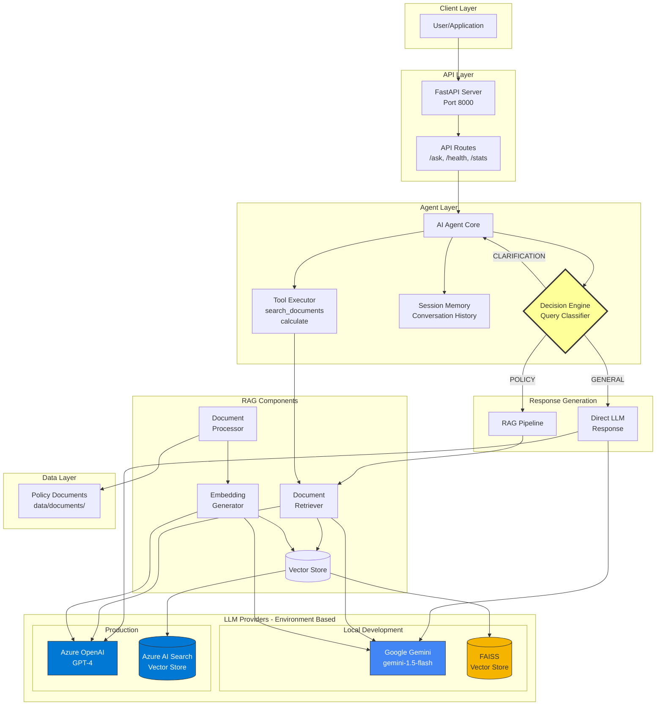

# System Architecture

## Overview

The AI Agent is an intelligent system that uses Retrieval-Augmented Generation (RAG) to answer questions about company policies. It features a decision engine that automatically chooses between direct LLM responses and document retrieval based on query classification.

---

## Architecture Diagram



---

## Component Description

### 1. API Layer

**FastAPI Server**
- High-performance async web framework
- Auto-generated OpenAPI documentation
- CORS support for web clients
- Global exception handling
- Request/response validation with Pydantic

**Endpoints:**
- `POST /ask` - Main query endpoint
- `GET /health` - Health check
- `GET /ready` - Readiness probe
- `GET /stats` - Agent statistics
- `GET /session/{id}` - Session information

### 2. Agent Layer

**AI Agent Core** (`app/agents/agent.py`)
- Main orchestration component
- Coordinates all components
- Manages request lifecycle

**Decision Engine**
- Classifies queries into three categories:
  - `GENERAL`: General knowledge → Direct LLM
  - `POLICY`: Company policy → RAG pipeline
  - `CLARIFICATION`: Unclear → Request more info
- Uses prompt engineering for classification
- Temperature: 0.3 for consistent classification

**Session Memory** (`app/agents/memory.py`)
- In-memory conversation storage
- Session-based isolation
- Automatic cleanup of expired sessions
- Configurable history length (default: 10 messages)

**Tool Executor** (`app/agents/tools.py`)
- Extensible tool system
- Current tools:
  - `search_documents`: Semantic document search
  - `calculate`: Simple math operations
- Easy to add new tools

### 3. LLM Integration

**Dual Environment Support:**

| Feature | Local (Development) | Production |
|---------|-------------------|------------|
| **LLM** | Google Gemini 1.5-flash | Azure OpenAI GPT-4 |
| **Speed** | Fast (optimized for speed) | Balanced |
| **Cost** | Free tier | Pay-per-use |
| **Embeddings** | Gemini embedding-001 (768-dim) | text-embedding-ada-002 (1536-dim) |
| **Vector Store** | FAISS (local file) | Azure AI Search (cloud) |
| **Setup** | Simple API key | Azure resources required |

**LLM Client** (`app/llm/llm_client.py`)
- Unified interface for both providers
- Automatic provider selection based on environment
- Retry logic with exponential backoff
- Streaming support
- Token counting

### 4. RAG Pipeline

**Document Processor** (`app/rag/document_processor.py`)
- Supports PDF and text files
- Chunking strategy:
  - Chunk size: 500 tokens
  - Overlap: 50 tokens
  - Preserves context across chunks
- Text cleaning and normalization
- Metadata extraction (source, page, chunk_id)

**Embedding Generator**
- Converts text to numerical vectors
- **Gemini**: 768-dimensional vectors
- **Azure**: 1536-dimensional vectors
- Batch processing for efficiency

**Vector Store** (`app/rag/vector_store.py`)
- **FAISS** (Local):
  - Fast similarity search
  - Disk persistence
  - No external dependencies
- **Azure AI Search** (Production):
  - Managed service
  - Hybrid search (keyword + vector)
  - High availability
  - Scalable

**Retriever** (`app/rag/retriever.py`)
- Semantic search with configurable top-k
- Re-ranking for improved relevance
- Source attribution
- Similarity threshold filtering

### 5. Data Flow

**Query Processing Flow:**

1. **User submits query** → FastAPI `/ask` endpoint
2. **Agent receives query** → Creates/retrieves session
3. **Query classification** → LLM classifies intent
4. **Route decision:**
   - **If GENERAL** → Direct LLM response
   - **If POLICY** → RAG pipeline:
     - Generate query embedding
     - Search vector store
     - Retrieve top-k documents
     - Inject into LLM context
     - Generate response with sources
   - **If CLARIFICATION** → Ask for more information
5. **Response formatting** → Include answer, sources, metadata
6. **Session update** → Store in conversation history
7. **Return to user**

---

## Data Architecture

### Directory Structure

```
data/
├── documents/              # Source policy DocumentsI'll complete the documentation files. Let me continue creating the architecture documentation and other required docs:

```python

